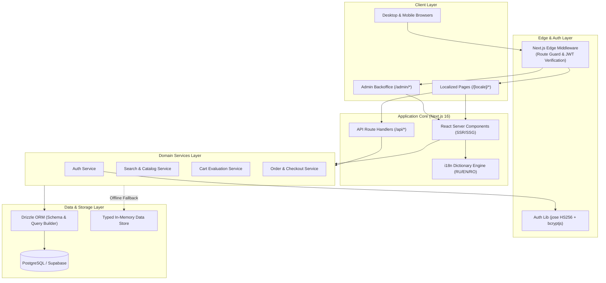

# Zento — Modern E-Commerce Platform for Digital Tech

> A high-performance, multilingual digital electronics e-commerce platform built with Next.js 16 App Router, React 19, TypeScript, Tailwind CSS v4, Drizzle ORM, and PostgreSQL.

[](https://zento-blue.vercel.app)
[](https://zento-blue.vercel.app)
[](https://nextjs.org/)
[](https://react.dev/)
[](https://www.typescriptlang.org/)
[](https://tailwindcss.com/)
[](https://orm.drizzle.team/)
[](https://supabase.com/)
[](https://vitest.dev/)
[](https://playwright.dev/)

> 🌐 **Live Production Deployment**: [https://zento-blue.vercel.app](https://zento-blue.vercel.app)  
> You can visit, test the catalog, interactive cart, multi-language switching (`RU` / `EN` / `RO`), card payment flow, and protected admin panel in real-time.

Zento is an end-to-end digital technology e-commerce application engineered as a modular monolith. It provides a localized customer storefront across three languages (RU, EN, RO), server-evaluated cart and checkout pipelines, secure role-based administrative backoffice tooling, and integer-precision financial accounting.

---

## 🌐 Live Production Demo

The project is live and deployed on **Vercel** with full database integration on **Supabase Cloud**:

- 🔗 **Production URL**: [https://zento-blue.vercel.app](https://zento-blue.vercel.app)
- 🛒 **Storefront (Russian)**: [https://zento-blue.vercel.app/ru](https://zento-blue.vercel.app/ru)
- 🛒 **Storefront (English)**: [https://zento-blue.vercel.app/en](https://zento-blue.vercel.app/en)
- 🛒 **Storefront (Romanian)**: [https://zento-blue.vercel.app/ro](https://zento-blue.vercel.app/ro)
- ⚙️ **Admin Backoffice**: [https://zento-blue.vercel.app/admin](https://zento-blue.vercel.app/admin) (Log in with `admin@zento.tech` / `admin123`)

---

## Overview

Modern digital tech storefronts demand sub-second page loads, internationalized catalogs, strict inventory and price snapshot consistency, and secure backoffice management. Zento was built to solve these engineering challenges within a cohesive, single-codebase architecture.

### Who Is It For?
- **Customers**: Consumers shopping for digital hardware (smartphones, laptops, audio gear, accessories) with real-time stock feedback, multi-attribute filtering, localized content, and streamlined checkout.
- **Store Administrators**: Store operators who require catalog management, dynamic product creation with specification matrixes, and live order status tracking.
- **Engineering Evaluators**: Technical interviewers looking for clean modular architecture, defensive backend validation, and test-covered business logic.

---

## Key Features

- 🌐 **True Tri-Lingual Localization (i18n)**: Route-driven internationalization (`/ru`, `/en`, `/ro`) using typed JSON dictionary files and zero-runtime translation overhead.
- ⚡ **Server-Side Rendered Catalog**: Indexed product search, category and brand filters, price range sliders, stock-only toggle, and multi-field sorting (`price_asc`, `price_desc`, `name_asc`, `featured`).
- 🛡️ **Defensive Checkout & Financial Integrity**: Integer minor-unit price handling (cents/bani), server-side stock and price re-evaluation, and immutable unit price snapshots in order history.
- 🔐 **Stateless JWT Authentication & Edge RBAC**: Secure `httpOnly` cookie-based session management, bcrypt password hashing, and Next.js Edge Middleware route guarding for the `/admin` backoffice.
- 📊 **Protected Admin Panel**: Centralized dashboard with product inventory counters, live order status tracker (`PENDING` -> `PROCESSING` -> `SHIPPED` -> `COMPLETED`), user registry, and dynamic product creation with automated slug generation.
- 💳 **Simulated Checkout & Card Processing**: Supports Cash on Delivery and interactive card checkout with card brand detection (Visa, Mastercard, Amex) and 3D-Secure simulation.
- 📜 **Legal Compliance Baseline**: Dedicated Privacy Policy and Terms of Service structured in accordance with Moldovan consumer and personal data protection regulations (Law No. 133/2011 & Law No. 105/2003).

---

## Architecture

Zento follows a **Modular Monolith** pattern within Next.js App Router. Server Components render data by default, Route Handlers and Server Actions handle mutations, service layers isolate domain logic, and Drizzle ORM interfaces with PostgreSQL.



### Component Breakdown
- **Edge Middleware (`src/middleware.ts`)**: Intercepts requests to `/admin/*`, validates the signed JWT in the `zento_session` cookie, checks for `ADMIN` role claim, and redirects unauthorized users.
- **Domain Services (`src/services/*`)**: Decouples business logic (catalog filtering, cart calculation, order creation, auth flow) from presentation components and API handlers.
- **Data Access (`src/db/*`)**: Strong TypeScript schema definition, migrations, and relational queries via Drizzle ORM connecting to PostgreSQL.
- **Localization Subsystem (`src/i18n/*`)**: Typed dictionary loader resolving locale params from route segments without client-side bundle bloat.

---

## Tech Stack

| Layer | Technology | Purpose |
| :--- | :--- | :--- |
| **Framework** | Next.js 16.3 (App Router) | Server Components, Route Handlers, Edge Middleware, Turbopack |
| **UI Library** | React 19 | Component hierarchy, client hooks, forms |
| **Styling** | Tailwind CSS v4 + PostCSS | Utility-first responsive design, light theme design tokens |
| **Language** | TypeScript 5 | Strict static typing (`noImplicitAny`), shared domain interfaces |
| **Database** | PostgreSQL (Supabase Cloud) | Relational data store, foreign keys, cascade deletes, indexes |
| **ORM** | Drizzle ORM & Drizzle Kit | Type-safe SQL dialect, schema migrations, push tooling |
| **Authentication** | Custom Auth.js (`jose` + `bcryptjs`) | JWT sessions in `httpOnly` cookies, salt hashing, RBAC |
| **Validation** | Zod v4 | Runtime schema validation for auth, checkout, and API payloads |
| **Testing** | Vitest & Playwright | 29 automated unit/integration tests and E2E smoke tests |
| **Package Manager** | npm (`Node.js >= 20.9.0`) | Dependency management and script execution |

---

## Engineering Highlights

### 1. Integer Minor-Unit Currency Representation
- **Problem**: JavaScript floating-point arithmetic (`0.1 + 0.2 !== 0.3`) causes rounding discrepancies and financial inaccuracies during price aggregation, discounts, and order item snapshots.
- **Solution**: All prices in the database schema (`products.price`, `orders.total_amount`, `order_items.unit_price`) and domain services are stored and computed strictly as integer minor units (e.g., `2799900` = 27,999.00 MDL). Conversion to decimal string representation occurs only at the final UI formatting boundary.
- **Why**: Eliminates IEEE 754 precision bugs, ensures deterministic subtotal calculations, and mirrors banking-grade accounting standards.

### 2. Server-Authoritative Cart & Order Snapshots
- **Problem**: Malicious clients can modify client-side localStorage prices or quantities before submitting an order.
- **Solution**: The checkout endpoint (`/api/orders/create` -> `order-service.ts`) accepts only product identifiers and requested quantities. The server invokes `evaluateCart()`, re-fetches current active prices and stock levels from the database, validates inventory boundaries, computes the authoritative total, and writes immutable price snapshots into `order_items`.
- **Why**: Guarantees zero revenue loss from tampering and preserves historical pricing accuracy even if catalog prices change later.

### 3. Edge-Guarded Role-Based Access Control (RBAC)
- **Problem**: Client-side protected routes can leak administrative UI or allow unauthorized access if token validation is deferred to component rendering.
- **Solution**: Next.js Edge Middleware intercepts all `/admin/:path*` requests, verifies the cryptographic HMAC signature of the JWT token via `jose`, checks `payload.role === 'ADMIN'`, and rejects unauthorized requests with HTTP 403 or redirects unauthenticated visitors to `/ru/auth/login?callbackUrl=...`.
- **Why**: Zero admin markup is sent over the wire to unauthorized clients, enforcing server-side access control at the network perimeter.

### 4. Zero-Dependency Custom JWT Session Management
- **Problem**: Heavy third-party auth platforms introduce third-party vendor lock-in, external network latency, and complex credential callbacks.
- **Solution**: Implemented a lightweight, standard-compliant JWT session pipeline with `jose` and `bcryptjs`. Tokens are stored in tamper-proof `httpOnly`, `sameSite: "lax"`, and `secure` (in production) cookies with a 7-day expiration.
- **Why**: Full architectural control over session tokens, zero external auth service latency, and effortless compatibility with Next.js Edge runtime.

### 5. Resilient Service Layer with Database Graceful Fallback
- **Problem**: CI/CD pipelines, offline local test runs, and database network blips can break developer environments and unit tests.
- **Solution**: All domain services (`searchCatalog`, `evaluateCart`, `createOrder`, `loginUser`) encapsulate database operations in resilient try-catch blocks backed by typed seed fallbacks.
- **Why**: Keeps test suites blazing fast and deterministic, allowing UI review and integration tests to run offline without provisioning a live cloud database.

---

## Project Structure

```text
zento/
├── src/
│   ├── app/                      # Next.js App Router pages and handlers
│   │   ├── [locale]/             # Public localized storefront (/ru, /en, /ro)
│   │   │   ├── auth/             # Login and Registration flows
│   │   │   ├── catalog/          # Product catalog with search and filters
│   │   │   ├── product/[slug]/   # Product detail page & specifications
│   │   │   ├── cart/             # Shopping cart view and item controls
│   │   │   ├── checkout/         # Order checkout and confirmation success
│   │   │   ├── privacy/          # Legal Privacy Policy (Moldova Law 133/2011)
│   │   │   └── terms/            # Legal Terms of Service (Moldova Law 105/2003)
│   │   ├── admin/                # Backoffice (/admin, /products, /orders, /users)
│   │   ├── api/                  # API endpoints (/api/auth, /api/orders, /api/products)
│   │   ├── globals.css           # Tailwind CSS v4 design tokens and root styles
│   │   └── layout.tsx            # Root HTML shell
│   ├── components/               # Modular UI component library
│   │   ├── admin/                # Admin forms and control widgets
│   │   ├── auth/                 # Login and register forms
│   │   ├── cart/                 # Cart item list and subtotal summary
│   │   ├── catalog/              # Filters, search bar, and product card grid
│   │   ├── checkout/             # Checkout form with simulated card input
│   │   ├── layout/               # Global Header, Footer, and Language Switcher
│   │   ├── product/              # Gallery, specs table, and AddToCart actions
│   │   └── ui/                   # Primitives (Button, Input, Card, Badge, CategoryIcon)
│   ├── db/                       # Database layer
│   │   ├── data/                 # Baseline product catalog & category data
│   │   ├── migrations/           # Checked-in Drizzle SQL migration files
│   │   ├── index.ts              # PostgreSQL client connection pool
│   │   ├── schema.ts             # Drizzle PostgreSQL schema definitions & indexes
│   │   └── seed.ts               # Database seed runner (20 products, categories, brands)
│   ├── i18n/                     # Internationalization layer
│   │   ├── dictionaries/         # JSON dictionaries (ru.json, en.json, ro.json)
│   │   ├── config.ts             # Locale definitions and validator
│   │   └── get-dictionary.ts     # Asynchronous dictionary loader
│   ├── lib/                      # Shared internal libraries
│   │   └── auth/                 # JWT sign/verify, password hash, and session cookies
│   ├── services/                 # Core domain business logic
│   │   ├── auth/                 # Registration, credentials check, session state
│   │   ├── cart/                 # Cart item resolution and stock boundary checking
│   │   ├── orders/               # Order generation, item snapshotting, and admin feed
│   │   └── search/               # Multi-criteria catalog filtering and pagination
│   └── middleware.ts             # Edge middleware for /admin route protection
├── tests/                        # Vitest automated test suite (10 test files, 29 tests)
├── e2e/                          # Playwright end-to-end browser tests
├── public/                       # Static images and product media
├── drizzle.config.ts             # Drizzle Kit migration tool configuration
├── playwright.config.ts          # Playwright runner configuration
├── vitest.config.ts              # Vitest runner configuration
└── package.json                  # Scripts and project dependencies
```

---

## Getting Started

### Prerequisites
- **Node.js**: `>= 20.9.0`
- **npm**: `>= 10.0.0`
- **PostgreSQL**: Supabase PostgreSQL database or local instance (optional for demo/testing mode)

### 1. Clone the Repository
```bash
git clone https://github.com/NikitaDmitrenco/zento.git
cd zento
```

### 2. Install Dependencies
```bash
npm install
```

### 3. Configure Environment Variables
Create a `.env.local` file in the root directory by copying the example template:
```bash
cp .env.example .env.local
```

Populate the variables in `.env.local`:
```env
# Database Connection (Supabase PostgreSQL / local PostgreSQL)
DATABASE_URL="postgresql://postgres:[PASSWORD]@[HOST]:[PORT]/postgres"
SUPABASE_URL="https://your-project.supabase.co"
SUPABASE_ANON_KEY="your-supabase-anon-key"

# Authentication Secrets
AUTH_SECRET="your-secure-random-jwt-secret-min-32-chars-long"
AUTH_URL="http://localhost:3000"
```

### 4. Apply Database Schema & Seed Data
```bash
# Push Drizzle schema to PostgreSQL
npm run db:push

# Populate database with categories, brands, 20 products, and default accounts
npm run db:seed
```

### 5. Launch the Development Server
```bash
npm run dev
```

Open [http://localhost:3000/ru](http://localhost:3000/ru) in your browser.

---

## Pre-Configured Test Credentials

For rapid verification and testing of authentication and authorization flows:

| Role | Email | Password | Permissions |
| :--- | :--- | :--- | :--- |
| **👑 Admin** | `admin@zento.tech` | `admin123` | Storefront browsing + Full access to `/admin` dashboard, product creation, orders, and user list |
| **👤 Customer** | `user@zento.tech` | `user123` | Storefront browsing, cart operations, customer checkout |

---

## Environment Variables

| Variable | Required | Description |
| :--- | :---: | :--- |
| `DATABASE_URL` | Yes (in production) | PostgreSQL connection string (supports direct & pooler connections). |
| `SUPABASE_URL` | Optional | Supabase project URL for cloud storage integration. |
| `SUPABASE_ANON_KEY` | Optional | Supabase public anonymous key. |
| `AUTH_SECRET` | Yes | 32+ character cryptographic secret used by `jose` to sign session JWTs. |
| `AUTH_URL` | Optional | Base application URL (e.g. `http://localhost:3000` or production domain). |

---

## Testing & Quality Assurance

The codebase enforces strict quality controls across unit tests, type safety, linting, and end-to-end browser scenarios.

```bash
# 1. Run all 29 automated unit and integration tests (Vitest)
npm run test

# 2. Run Vitest in interactive watch mode
npm run test:watch

# 3. Perform strict TypeScript static typecheck (noEmit)
npm run typecheck

# 4. Run ESLint code quality checks
npm run lint

# 5. Run Playwright End-to-End browser tests
npm run test:e2e

# 6. Verify production build
npm run build
```

### Test Suite Breakdown (10 Passed Suites, 29 Tests)
- `tests/auth.test.ts`: Password hashing (`bcryptjs`), JWT token generation, role decoding, and signature tampering rejection.
- `tests/admin.test.ts`: Server-side authorization verification for `ADMIN` vs `USER` roles.
- `tests/cart.test.ts`: Cart item valuation, subtotal math, and stock boundary clamping.
- `tests/checkout.test.ts`: Zod schema validation for customer contact details, order initialization, and price snapshot preservation.
- `tests/catalog.test.ts`: Search query text matching, category slug filtering, pagination, and ascending/descending price sorting.
- `tests/db.test.ts`: Schema integrity, category and brand enumerations, and seed catalog validation.
- `tests/i18n.test.ts`: Locale validation (`ru`, `en`, `ro`) and dictionary completeness.
- `tests/legal.test.ts`: Verification of localized legal footer contracts and statutory compliance.
- `tests/product.test.ts`: Product slug uniqueness and specification lookup.
- `tests/smoke.test.ts`: Baseline runtime environment assertion.

---

## API Reference

### Authentication Endpoints
| Method | Endpoint | Description | Auth Required |
| :--- | :--- | :--- | :---: |
| `POST` | `/api/auth/register` | Registers a new user, hashes password, sets `zento_session` cookie | Public |
| `POST` | `/api/auth/login` | Validates credentials, sets `httpOnly` JWT session cookie | Public |
| `POST` | `/api/auth/logout` | Clears `zento_session` cookie | Public |
| `GET` | `/api/auth/me` | Returns current active user session payload | Public |

### Order & Catalog Endpoints
| Method | Endpoint | Description | Auth Required |
| :--- | :--- | :--- | :---: |
| `POST` | `/api/orders/create` | Validates cart items, verifies stock, creates order with `PENDING` status | Public |
| `POST` | `/api/products/create` | Creates new catalog item, categories/brand relation, and image links | `ADMIN` Role |

---

## Screenshots / Demo

<!-- Add screenshots or demo GIF here -->
| Storefront Catalog | Product Detail & Specs | Admin Backoffice |
| :---: | :---: | :---: |
| *(Catalog filters, search, and sorting)* | *(Gallery, stock status, specs matrix)* | *(Metrics, product creation, order stream)* |

---

## Performance, Security & Reliability

- **Database Indexing**: Explicit PostgreSQL indexes on `slug`, `categoryId`, `brandId`, `price`, `isActive`, `status`, and `userId` prevent full table scans during catalog searches.
- **Serverless Database Optimization**: PostgreSQL client configured with `prepare: false` and SSL enforcement for connection poolers (Supabase / AWS PgBouncer).
- **Zero XSS & CSRF Attack Surface**: Authentication tokens stored exclusively in `httpOnly`, `SameSite=Lax` cookies; inaccessible to client-side scripts.
- **Runtime Schema Validation**: All user inputs (registration, login, checkout, product creation) pass through strict Zod schemas before hitting business logic or database queries.
- **Graceful Error Boundaries**: Not-found boundaries (`notFound()`), localized 404 pages, and user-friendly error states across catalog and checkout forms.

---

## Challenges & Technical Decisions

### Challenge 1: Clean Internationalization without Framework Complexity
- **Decision**: Implemented route-segment localization (`/[locale]/...`) coupled with typed JSON dictionaries loaded via server-side asynchronous imports (`getDictionary(locale)`), avoiding heavy client-side i18n runtime bundles.
- **Result**: Zero client JS runtime footprint for translations, fully static SSR-compatible metadata, and 100% type-safe dictionary keys.

### Challenge 2: Decoupled Search Architecture
- **Decision**: Routed all catalog queries through an abstract `searchCatalog(filters)` service interface backed by indexed PostgreSQL `ilike` and relational joins, rather than hardcoding ORM queries in UI components.
- **Result**: Complete isolation of the data access layer. Future migration to specialized search engines (e.g. Meilisearch / Elasticsearch) requires changing only `search-service.ts` without touching UI or route handlers.

### Challenge 3: Atomic Order Creation & Price Volatility
- **Problem**: Product prices in digital tech stores fluctuate frequently. Orders placed at historical prices must not reflect later price hikes or discounts.
- **Decision**: Structured `order_items` with dedicated `unit_price` integer columns populated from server-side price snapshots at the exact moment of order execution.
- **Result**: 100% financial audit compliance and immutable purchase records.

---

## Future Improvements

- [ ] **Real Payment Gateway Integration**: Connect Stripe / Paynet webhooks with cryptographic signature verification.
- [ ] **Asynchronous Message Queue**: Integrate background worker (e.g., BullMQ / Redis) for transactional order confirmation emails and SMS notifications.
- [ ] **Full-Text Search Enhancement**: Implement PostgreSQL `tsvector` / `pg_trgm` fuzzy matching or Meilisearch for typo-tolerant product queries.
- [ ] **Direct S3 / Supabase Pre-Signed Uploads**: Enable direct browser-to-bucket image uploads for admin product management.
- [ ] **Expanded E2E Scenario Matrix**: Extend Playwright coverage across full user authentication, cart modification, and admin product creation workflows.

---

## Engineering Competencies Demonstrated

- **Full-Stack System Design**: Clean modular monolith layering, separation of presentation, domain services, and data persistence.
- **Database Engineering**: Normalized PostgreSQL schema design, composite indexing, Drizzle migrations, and financial integer arithmetic.
- **Defensive Security & Auth**: Edge middleware RBAC, stateless JWT session lifecycles, password hashing, and runtime input validation.
- **Internationalization (i18n)**: Scalable multi-language architecture with static SEO optimization.
- **Automated Testing & QA**: Thorough unit, integration, and static typecheck test pipelines (Vitest, TypeScript, ESLint, Playwright).

---

## Author & License

Developed by **Nikita Dmitrenco** as an engineering demonstration of a modern digital commerce application.

- **GitHub**: [@NikitaDmitrenco](https://github.com/NikitaDmitrenco)
- **Repository**: [https://github.com/NikitaDmitrenco/zento](https://github.com/NikitaDmitrenco/zento)
- **License**: MIT
